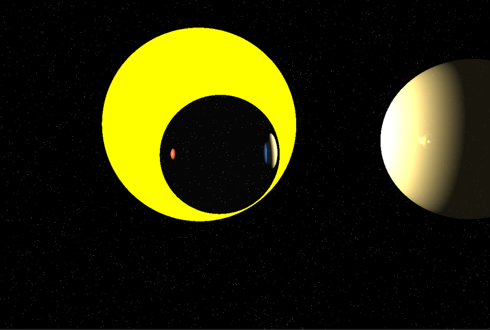
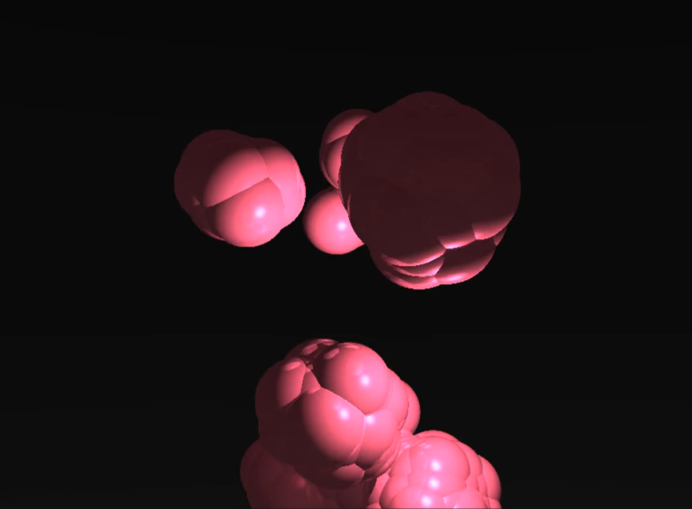
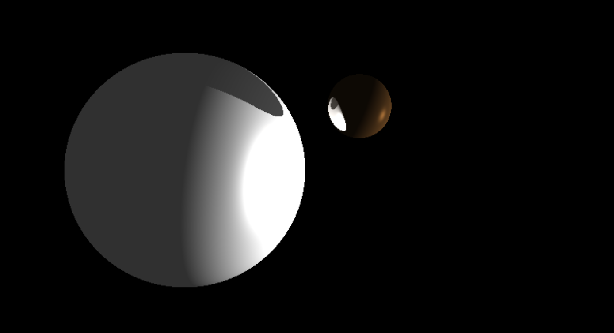

# CUDA-Accelerated Ray Tracer with Audio-Reactive Boids

A real-time ray tracer implemented in Python and CUDA that combines physically-based rendering with an audio-reactive birds flocking simulation - using the Boids algorithm.

Note: This is my tiny tribute to one of my favourite songs - Flume (fav artist) X Greenpeace (environmental activism network)



## Features

### A Basic Ray Tracing Engine
- CUDA kernel for ray-sphere intersection and shading calculations
- Lighting with ambient, diffuse, and specular shading
- Soft shadows and reflective surfaces
- Real-time perf through GPU acceleration
- Shitty Aim Trainer using PyGame for ui and coloring the pixels.

### Audio-Reactive Boids Simulation
- Implementation of Craig Reynolds' Boids flocking algorithm
- 256 concurrent bird agents rendered as reflective spheres
- Real-time audio reactivity:
  - Flock behavior modulated by frequency analysis
  - Movement parameters controlled by beat detection
  - Visual properties (color, size, reflectivity) respond to audio features

### FPS Controls
- First-person camera controls (WASD + mouse)
- Real-time spectator mode to observe the flock
- Dynamic adjustment of simulation parameters

## Performance
- Significant speedup achieved through CUDA acceleration (1000x if my calulations are right)
- Comparative benchmarks between:
  - Raw Python implementation
  - Numba JIT compilation
  - CUDA parallel processing
- Real-time performance monitoring and visualization

## Implementation Details

### CUDA Optimizations
- Custom CUDA kernels for core rendering ops

### Audio Processing
- Real-time FFT analysis for frequency separation
- Onset detection for beat recognition
- Multi-band audio feature extraction

## Getting Started

### Prerequisites
- Python 3.8+
- NVIDIA GPU with CUDA support
- Poetry for dependency management

### Installation
```bash
# Clone the repository
git clone https://github.com/floaredor/cuda-raytracer.git
cd cuda-raytracer

# Install dependencies
poetry install
```

### Running the Demo
```bash
# Run with default audio file
python experiments/music_boids.py

# Run with custom audio file
python experiments/music_boids.py path/to/your/audio.wav
```

### Controls
- `W/A/S/D` - Move camera
- `Mouse` - Look around
- `ESC` - Exit and generate performance plots

## Visualization Examples

### Shadows


### Boids Algorithm


### Random Experimental


### Glazed Surfaces


## To Do
- [ ] Multiple light sources
- [ ] Anti-aliasing
- [ ] More complex geometries
- [ ] UI for parameter adjustment like ImGUI

## Project Background
This project was developed as a practical exploration of NVIDIA's CUDA Python course concepts. It shows the application of parallel processing techniques to graphics and nature-based simulation while incorporating real-time audio processing for an interactive experience.

## License
MIT

## Acknowledgments
- NVIDIA for their CUDA Python course
- Craig Reynolds for the original Boids algorithm