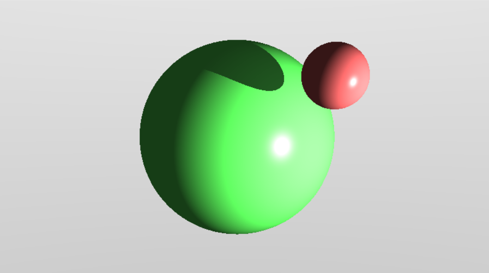

## A cuda-based implementation of a simple Ray Tracer

- ambient, diffuse and specular shading
- shadows
- glazed surfaces
- basic fps controls
- benchmark for cuda vs numba.jit vs raw python
- simple aim trainer game using raytracer
- audio reactive boids algorithm implementation

### To do:

- write a better readme file

